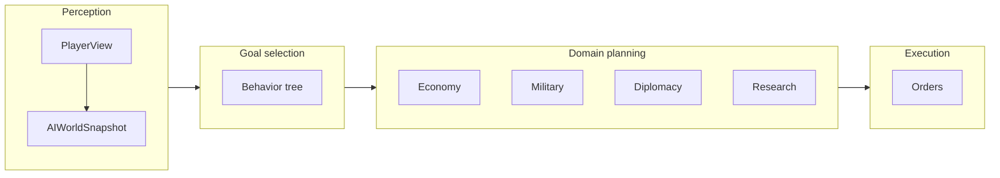

# AI Architecture (Phase 6)

**SPEC/ai** — Hybrid AI stack for MVP. Source: GDD 10b, TDD 10. Implementation: [ai-systems-impl.md](../program/ai-systems-impl.md).

---

## Design philosophy

- **Characterful personalities** — Each leader feels distinct (GDD 10a).
- **Deterministic** — Same game state and seeds → same AI decisions.
- **PlayerView-only** — AI never reads hidden tiles or enemy data; all world knowledge comes from [PlayerView](../program/player-view.md).
- **Single algorithm, difficulty via params** — Difficulty affects only starting resources and ruleset modifiers, not AI strength or logic.

---

## Hybrid stack

| Layer | System | Purpose |
|-------|--------|---------|
| **Goal management** | Behavior trees | Long-term strategy (expand, defend, trade, conquer, tech, diplomacy). |
| **Strategic** | Utility AI | Domain decisions: economy, military, diplomacy, research. |
| **Tactical** | Shallow search / heuristics | Quick Battle actions; local move/attack choices. |

Behavior trees pick top-level goals; utility AI scores and selects concrete objectives; tactical layer produces combat and movement orders.

---

## Turn pipeline (per AI Great Power, per turn)

1. **Perception** — Build `PlayerView` (colonizethis_logic). Derive `AIWorldSnapshot`: threats, opportunities, economy, relations. All from PlayerView; no hidden data.
2. **Goal selection** — Behavior tree chooses strategy (defend, expand, conquer, trade, tech, diplomacy) using personality weights and hidden agenda modifiers.
3. **Domain planning** — Economy, military, diplomacy, research planners use the [order suggestion API](../program/order-engine.md) with PlayerView; utility scoring applies personality and agenda; each emits candidate orders.
4. **Execution** — Combine and cap orders; validate via order engine; emit dialogue/mood events where specified.
5. **Tactical** — For Quick Battle, tactical planner consumes battle state and seeds; outputs CP-based actions (deterministic).

---

## Seeding and determinism

Per [ai-planner.md](../program/ai-planner.md): `turnSeed[P, T] = hash(globalGameSeed, aiSeed[P], T)`. From this, derive sub-seeds:

- `perceptionSeed`, `goalSeed`, `economySeed`, `militarySeed`, `diplomacySeed`, `researchSeed`, `tacticalSeed`, `dialogueSeed`, `agendaSeed` (for agenda assignment at game start).

All AI randomness uses these seeds. Same save + same seeds → same orders and events.

---

## Package boundary

**colonizethis_ai** owns: perception adapter (PlayerView → snapshot), behavior trees, domain planners, tactical planner, hidden agenda logic, dialogue/mood emission, dossier projection.

**colonizethis_logic** owns: game state, turn resolution, order engine, PlayerView construction, order suggestion API. Logic calls into colonizethis_ai for order generation and receives events.

App and (future) server call colonizethis_ai; they do not duplicate AI logic.
