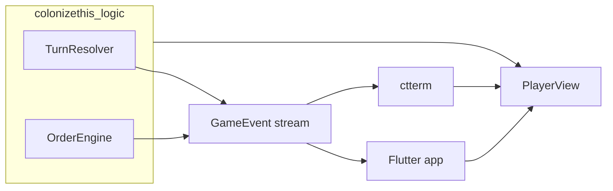

# ctterm — Terminal UI (Nocterm)

**SPEC/tui** — Full single-player ColonizeThis experience via a terminal UI. Cross-references only to SPEC; concepts from UXD/GDD/TDD are copied in where required.

---

## 1. High-level UI flow

### Entry

App start → **Main Menu** (ctterm equivalent of UXD 03a). The Main Menu is the first screen shown (except possibly a splash/logo). The menu shows at least: **New Game**, **Load Game**, **Settings**, and **Quit** (or platform-appropriate equivalent). Source: [SPEC/ui/main-menu.md](../ui/main-menu.md).

### Flows

- **Main Menu** → **New Game** → Game Setup (03b) → Generating world → In-game shell.
- **Main Menu** → **Load Game** → save list (same as 03b: save label, turn, year, GP, last played; no user-editable names for MVP) → Load → In-game shell.
- **Main Menu** → **Settings** → TUI-only options (terminal theme only for now) → return to Main Menu.
- **In-game shell** → Pause/Options → Exit to Main Menu (clear in-memory state).
- **In-game shell** → End of turn with victory → Victory Screen (03l) or **Defeat Screen** (new).

If at least one save exists, **Load Game** is enabled; if none exist, it is disabled with an explanatory tooltip or helper text. Clicking or tapping **New Game** navigates to the Game Setup screen (03b), not directly into play. Clicking or tapping **Load Game** navigates to the Load Game list (03b). Clicking or tapping **Settings** opens the Settings UI (03c) and closing it returns to the Main Menu. From a running game, choosing "Exit to Main Menu" (from pause/options) returns to this screen and clears in-memory game state.

### Victory vs Defeat

Victory condition and check are defined in [SPEC/game/victory.md](../game/victory.md): a Great Power controls **31 or more Old World provinces**; control means the province’s `ownerId` equals that GP’s player id. Province identity and counting use prefixed province id (`regionId|localId`) and region-scoped lookup per [world-model-identity.md](../game/world-model-identity.md). Victory is evaluated once per turn during the End-of-turn phase, after all other phases have run. If `Game.victory` is already set, the check does not overwrite it. When two or more GPs each have ≥31 OW provinces in the same turn, the winner is the one with the lexicographically smallest player id.

- When `Game.victory != null` and the winner **is** the human player: show **Victory screen** (winner’s display name, victory type label e.g. "Military victory", turn number; actions: Return to main menu, View final state). No further orders or turn advancement once victory is set.
- When `Game.victory != null` and the winner is **not** the human player: show **Defeat screen**. Content: "You have been defeated", winner’s display name, victory type label, final standings. Actions: View Final Map, Return to Main Menu. No further orders or turn advancement.

After a victory or defeat, pressing "Return to Main Menu" returns to the Main Menu. When returning from in-game or from Victory/Defeat screen, the shell clears in-memory game state as needed.

### Screens in the flow

- Main Menu, Game Setup, Load Game, Generating World, Settings
- In-game shell (map + HUD + empire sidebar + context panel)
- Units, Development, Production, Academy, Shipyard, Diplomacy, Technology, Victory/Progress panels
- Victory screen, Defeat screen, Pause/Options

Cross-references: [SPEC/ui/main-menu.md](../ui/main-menu.md), [SPEC/ui/game-setup.md](../ui/game-setup.md), [SPEC/game/victory.md](../game/victory.md), [SPEC/program/save-load.md](../program/save-load.md), [SPEC/program/game-setup-pipeline.md](../program/game-setup-pipeline.md).

---

## 2. TUI design conventions

### Framework

ctterm uses **Nocterm** (Dart, Flutter-like TUI). Reference: <https://docs.nocterm.dev/docs>. ctterm is the first consumer in-repo; no Nocterm-based code exists elsewhere yet.

### Input

**Keyboard-first.** Some UI elements may support touch per Nocterm docs (e.g. list selection). No swipe or gesture requirement for MVP.

### Terminal theme

Only TUI-specific setting for now: terminal theme (e.g. light/dark or palette name). The Settings screen is adapted to TUI-only options; no audio or graphics options from 03c.

### Smartphone form factor

Layouts must work on small terminals (e.g. Termux, Termius). Constraints: narrow width, limited lines, scrollable content; panels are stacked or cycled rather than side-by-side where the UXD uses a sidebar and right panel. Minimum target size for interactive elements: in terminal terms, use a minimum selectable row height or key spacing so that actions are reliably activatable (UXD 03 specifies 44dp minimum for touch; ctterm adapts this for character cells and keyboard).

### Map (ASCII/Unicode art)

- **TUI mapping:** Ctterm defines its own TUI-specific mapping from map/PlayerView data to terminal display (terrain, ownership → characters/styles). See [SPEC/tui/map-tui-mapping.md](map-tui-mapping.md). Base map layer uses the same information as [SPEC/program/map-visualization.md](../program/map-visualization.md); ctterm is a consumer.
- **Layers:** Multiple layers for terrain, towns, province ownership, and other data. Do not cram all information into one layer. Data source for ownership, capitals, ports, and visibility: [SPEC/program/map-visualization.md](../program/map-visualization.md), [SPEC/program/player-view.md](../program/player-view.md).
- **Visibility:** Respect per-player visibility. Map rendering for the human player uses the same rules as PlayerView: fog, revealed, fully visible. PlayerView is the channel for information from the map; visibility is taken from the game’s visibility state (e.g. `WorldState.playerVisibilityByTile`). See [SPEC/program/player-view.md](../program/player-view.md).
- **Identity:** Province and tile keys follow [SPEC/game/world-model-identity.md](../game/world-model-identity.md) (prefixed province id, tile key format `regionId|localId|x|y`). Logic must never locate a province by province id alone.
- **Smartphone map:** Provide a way to scroll the map and/or cycle between regions (e.g. Old World / New World) so the full map is usable on a small terminal.

### Screen IDs

Each top-level screen has a unique **6-digit screen ID** shown in a bar at the top-right of the screen for easy identification (e.g. when discussing which screen is meant). Source of truth: `CttermRoute.screenId` in `ctterm/lib/ctterm_routes.dart`. IDs: Main Menu 100001, Game Setup 100002, Load Game 100003, Generating World 100004, Settings 100005, In-game shell 100006, Map context 100007, Units 100008, Development 100009, Production 100010, Academy 100011, Shipyard 100012, Diplomacy 100013, Technology 100014, Victory/Progress 100015, Victory 100016, Defeat 100017, Pause/Options 100018.

### Acceptance criteria format

All ctterm acceptance criteria MUST be written as **Given–When–Then** per project rules. Include TUI-specific cases where applicable (e.g. "Given the terminal is 80×24, when the user opens the Units panel, then the panel is shown and the map remains in the shell.").

---

## 3. UI – game logic – event communication architecture

### Shared event stream

A **game event stream** is consumed by all clients (Flutter app, ctterm). Its contract is defined in [SPEC/program/game-events.md](../program/game-events.md). Events are emitted during or after turn resolution and on order validation (e.g. combat result, province captured, diplomacy change, research complete, victory/defeat, order rejected). No UI-specific fields in events; consumers (app, ctterm) map events to notifications and UI.

### ctterm subscription

ctterm subscribes to the same game event stream. A notifications/event feed in the TUI (e.g. status line, scrollable log, or overlay) displays events to the user so they are clearly notified what is happening. Emission points and determinism are specified in [SPEC/program/game-events.md](../program/game-events.md) and [SPEC/program/turn-resolution-phase-details.md](../program/turn-resolution-phase-details.md). Dialogue and mood events ([SPEC/program/ai-events-and-dossier.md](../program/ai-events-and-dossier.md)) may be a separate channel or folded into the same stream as defined in game-events.md.

### Data flow

PlayerView and save/load contracts are unchanged; ctterm uses the same PlayerView and save-load APIs as the rest of the project.

---

## 4. Reference to all UI screens

### Where SPEC sources live

- **Existing SPEC (current project):** Screens that already have a spec use that document as the behavioural source. Paths are under SPEC/ui/, SPEC/game/, or SPEC/program/ (see table below).
- **Yet-to-be-written specs for ctterm screens:** Any screen that does not have a dedicated SPEC today, or that needs a ctterm-specific screen spec (layout, TUI-only AC), will have its spec written under **SPEC/tui/screens/** with one file per screen. Naming: `SPEC/tui/screens/<screen-key>.md` where `<screen-key>` is kebab-case (e.g. `main-menu`, `load-game`, `in-game-shell`, `units`, `defeat`). Those docs define layout, navigation, and Given–When–Then for the TUI; they reference existing SPEC/game and SPEC/program for game rules and data.

### Convention for the table

- **SPEC source (existing):** Full path to the existing spec that defines behaviour. Use "—" when there is no existing screen spec (e.g. Settings).
- **TUI screen spec (to be written):** Path `SPEC/tui/screens/<screen-key>.md` where the ctterm-specific screen spec will be written. Use "— (adaptations in ctterm.md)" when the screen is fully covered by an existing SPEC plus inline TUI adaptations in this document.

### Screens

| Screen                 | SPEC source (existing)                                                                                                                                       | TUI screen spec (to be written)   | UXD  | Note                                                           |
| ---------------------- | ------------------------------------------------------------------------------------------------------------------------------------------------------------ | --------------------------------- | ----- | -------------------------------------------------------------- |
| Main Menu              | [SPEC/ui/main-menu.md](../ui/main-menu.md)                                                                                                                 | — (adaptations in ctterm.md)      | 03a   | List + keyboard; Load enabled/disabled per save presence       |
| Game Setup             | [SPEC/ui/game-setup.md](../ui/game-setup.md)                                                                                                               | — (adaptations in ctterm.md)      | 03b   | Six slots, nation/leader; Start when complete; no pixel assets |
| Load Game              | [SPEC/ui/game-setup.md](../ui/game-setup.md) (Load list)                                                                                                   | [SPEC/tui/screens/load-game.md](screens/load-game.md) | 03b   | Save list as 03b; Back, Load, Delete with confirm              |
| Generating World       | [SPEC/program/game-setup-pipeline.md](../program/game-setup-pipeline.md)                                                                                   | — (adaptations in ctterm.md)      | 03b   | Blocking state; optional cancel                                |
| Settings               | —                                                                                                                                                            | [SPEC/tui/screens/settings.md](screens/settings.md) | 03c   | Terminal theme only                                            |
| In-game shell          | [SPEC/program/player-view.md](../program/player-view.md), [SPEC/program/map-visualization.md](../program/map-visualization.md)                             | [SPEC/tui/screens/in-game-shell.md](screens/in-game-shell.md) | 03d, 03m | ASCII map layers; HUD; sidebar to panels                       |
| Map / Province context | [SPEC/program/player-view.md](../program/player-view.md), [SPEC/program/map-visualization.md](../program/map-visualization.md)                             | [SPEC/tui/screens/map-context.md](screens/map-context.md) | 03d   | Layers; visibility; scroll/cycle regions                        |
| Units                  | [SPEC/program/order-engine.md](../program/order-engine.md), [SPEC/game/combat.md](../game/combat.md) (orders)                                               | [SPEC/tui/screens/units.md](screens/units.md) | 03e   | List stacks; detail; Move/Attack/Clear per order-engine          |
| Development            | [SPEC/program/development-resolution.md](../program/development-resolution.md)                                                                              | [SPEC/tui/screens/development.md](screens/development.md) | 03f   | Builders, engineers                                            |
| Production             | [SPEC/game/stockpiles-and-production.md](../game/stockpiles-and-production.md), [SPEC/program/extraction-pipeline.md](../program/extraction-pipeline.md)   | [SPEC/tui/screens/production.md](screens/production.md) | 03g   | Extraction, workers                                            |
| Academy                | [SPEC/game/military-units.md](../game/military-units.md)                                                                                                     | [SPEC/tui/screens/academy.md](screens/academy.md) | 03h   | Military training                                              |
| Shipyard               | [SPEC/game/ships-and-naval.md](../game/ships-and-naval.md)                                                                                                   | [SPEC/tui/screens/shipyard.md](screens/shipyard.md) | 03i   | Naval construction                                              |
| Diplomacy              | [SPEC/game/diplomacy.md](../game/diplomacy.md), [SPEC/program/diplomacy-resolution.md](../program/diplomacy-resolution.md)                                   | [SPEC/tui/screens/diplomacy.md](screens/diplomacy.md) | 03j   | War/peace                                                      |
| Technology             | [SPEC/game/research-state.md](../game/research-state.md), [SPEC/program/research-resolution.md](../program/research-resolution.md)                         | [SPEC/tui/screens/technology.md](screens/technology.md) | 03k   | Research                                                       |
| Victory / Progress     | [SPEC/game/victory.md](../game/victory.md)                                                                                                                   | [SPEC/tui/screens/victory-progress.md](screens/victory-progress.md) | 03l   | Progress overview; Victory screen when human wins              |
| Defeat                 | [SPEC/game/victory.md](../game/victory.md) (extended)                                                                                                        | [SPEC/tui/screens/defeat.md](screens/defeat.md) | —     | New: when other GP wins; View Final Map / Main Menu            |
| Pause/Options          | [SPEC/ui/main-menu.md](../ui/main-menu.md) (return flow)                                                                                                     | [SPEC/tui/screens/pause-options.md](screens/pause-options.md) | 03a   | Exit to Main Menu                                              |

### Summary

All TUI screen specs under SPEC/tui/screens/ will be created when those screens are specified in detail. This document references these paths so that future work knows where each screen’s spec will live. Existing SPEC paths (SPEC/ui/, SPEC/game/, SPEC/program/) are used as-is; no new files there for ctterm except [SPEC/program/game-events.md](../program/game-events.md).

Acceptance criteria carried over from existing SPECs must be restated in Given–When–Then form with TUI adaptations in the corresponding SPEC/tui/screens/<screen-key>.md (or inline in this document where no separate screen file is used).

---

## 5. Development setup

This section records development decisions for ctterm. Package placement is defined here; see also [SPEC/program/repo-and-packages.md](../program/repo-and-packages.md).

- **Package placement:** Top-level **`ctterm/`** at repo root (like ctdev). Pure Dart executable; no Flutter SDK. Run with `dart run ctterm` from repo root (or `melos run ctterm`).
- **Game events:** The game event stream is implemented in colonizethis_logic first; ctterm only consumes it. Logic has no knowledge of UI display. Events are built progressively as the TUI requires them. See [SPEC/program/game-events.md](../program/game-events.md).
- **Data flow / dependencies:** Generate map first, then derive topology (same as ctdev). Ctterm depends on: colonizethis_save, colonizethis_logic (and transitively colonizethis_models, colonizethis_data, colonizethis_map, colonizethis_ai). Same package set as ctdev. If colonizethis_save or colonizethis_logic need augmentation for ctterm (e.g. Hive path injection), add minimal API or options in those packages.
- **Storage:** A **separate Hive directory** is used for ctterm (not shared with app or ctdev). Pure Dart cannot use `path_provider`; use a fixed convention: e.g. `$HOME/.colonizethis_ctterm` (or on Linux, `$XDG_DATA_HOME/colonizethis_ctterm` when set). Implement in ctterm using `dart:io` Platform and the `path` package. Optional CLI flag `--data-dir <path>` overrides the default; document in [docs/project-tools.md](../../docs/project-tools.md).
- **Nocterm:** Use latest stable (e.g. `nocterm: ^0.4.2`). No extra version constraints. Ctterm must detect terminal size and resize elements responsively.
- **Testing:** 90% coverage is required for the ctterm package. Use mocks; refer to Nocterm docs (e.g. `testNocterm()`) for TUI component tests. Critical paths: main menu and navigation; load map/empire views; assign units (civilian, military, naval); development; production; academy; shipyard; technology; end turn.
- **Navigation:** Full navigation structure with stubs for all panels: Main Menu, Game Setup, Load Game, Generating World, Settings, In-game shell, Units, Development, Production, Academy, Shipyard, Diplomacy, Technology, Victory/Progress, Defeat, Pause/Options.
- **Map TUI mapping:** Ctterm defines its own TUI-specific mapping (terrain/ownership → characters or styles). Document in [SPEC/tui/map-tui-mapping.md](map-tui-mapping.md). Base map layer uses the same data as [SPEC/program/map-visualization.md](../program/map-visualization.md); ctterm is a consumer.
- **Logging:** Use multiple log prefixes for easy identification: `tui:`, `tui:menu:`, `tui:save:`, `tui:nav:` (and later `tui:map:`, `tui:event:`). Use Dart `logger`; no `print` for operational output. See [SPEC/program/ctdev-logging.md](../program/ctdev-logging.md) for level and prefix conventions.
- **Project tools:** Ctterm is documented in [docs/project-tools.md](../../docs/project-tools.md) (invocation, optional `--data-dir`, link to this spec).

---

## Package placement

ctterm runs as a standalone Dart executable in the top-level **`ctterm/`** package. See §5 Development setup above for full placement and run instructions.
